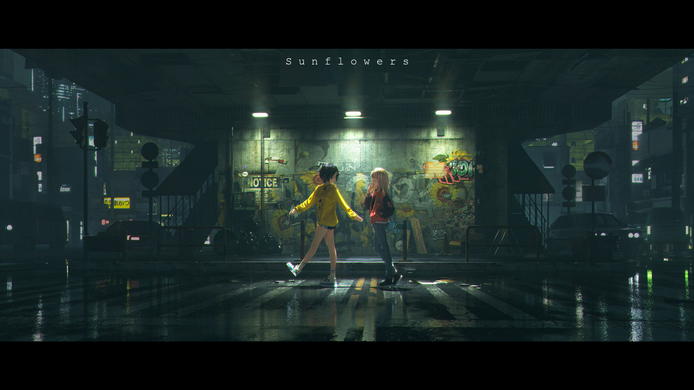
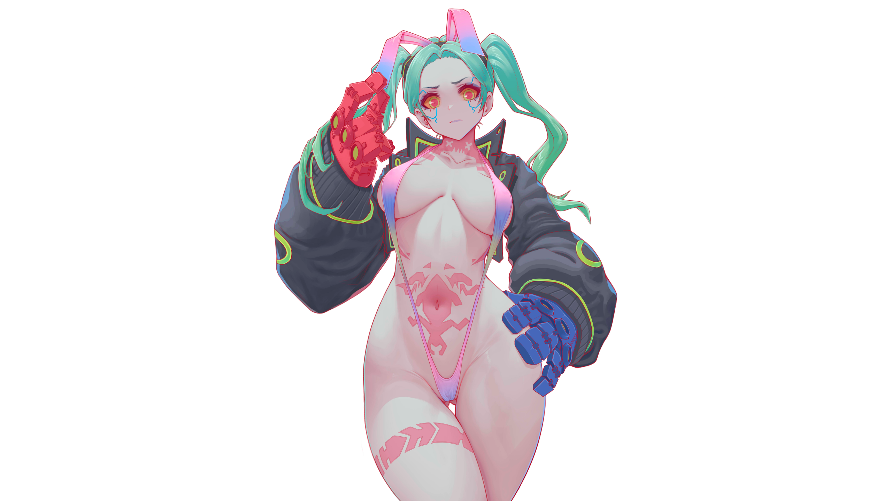

# My Project

Welcome to the My Project repository. This project demonstrates a GitHub Action that automatically updates image thumbnails in this README file whenever image files are added or removed from the repository.

## Image Gallery

The thumbnails below are automatically generated from image files (e.g., `.png`, `.jpg`, `.jpeg`, `.gif`) present in the repository. The GitHub Action scans for images and updates this section between the marker comments on each commit.

<!-- START THUMBNAILS -->

\n

<!-- END THUMBNAILS -->

## How It Works

1. **GitHub Action Trigger:**  
   The action defined in `.github/workflows/update-readme.yml` runs on every push to the `main` branch.

2. **Image Detection & Thumbnail Generation:**  
   The helper script (`.github/scripts/update-readme.sh`) searches for image files in the repository, creates HTML `` tags for each (using a fixed width for thumbnails), and replaces the content between the markers.

3. **Automatic Updates:**  
   If images are added or removed, the script updates the gallery section and commits the changes back to the repository.

## Setup

- **Repository Structure:**  
  Ensure your repository includes the following:

  - `.github/workflows/update-readme.yml` – The workflow file.
  - `.github/scripts/update-readme.sh` – The helper script.
  - `README.md` – This file.

- **Image Files:**  
  Place your image files anywhere in the repository. The script ignores the `.git` folder.

## Contributing

Feel free to open issues or submit pull requests to improve this project or suggest new features. Your contributions are welcome!

---

_This README file is automatically maintained by our GitHub Action that manages the image gallery section._
