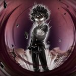
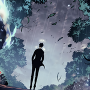

# My Wallpaper Gallery

This repository contains a collection of wallpapers that I like. The images are displayed in a gallery format below.

## Image Gallery

The thumbnails below are automatically generated from image files (e.g., `.png`, `.jpg`, `.jpeg`, `.bmp`) present in the repository. The GitHub Action scans for images and updates this section between the marker comments on each commit.

<!-- START THUMBNAILS -->
<table><tr><td align="center"></td><td align="center"></td><td align="center"></td><td align="center"></td><td align="center"></td></tr><tr><td align="center"></td><td align="center"></td><td align="center"></td><td align="center"></td><td align="center"></td></tr><tr><td align="center"></td><td align="center"></td><td align="center"></td><td align="center"></td><td align="center"></td></tr><tr><td align="center"></td><td align="center"></td><td align="center"></td><td align="center"></td><td align="center"></td></tr><tr><td align="center"></td><td align="center"></td><td align="center"></td><td align="center"></td><td align="center"></td></tr><tr><td align="center"></td><td align="center"></td><td align="center"></td><td align="center"></td><td align="center"></td></tr><tr><td align="center"></td><td align="center"></td><td align="center"></td><td align="center"></td><td align="center"></td></tr><tr><td align="center"></td><td align="center"></td><td align="center"></td><td align="center"></td><td align="center"></td></tr><tr><td align="center"></td><td align="center"></td><td align="center"></td><td align="center"></td><td align="center"></td></tr><tr><td align="center"></td><td align="center"></td><td align="center"></td><td align="center"></td><td align="center"></td></tr><tr><td align="center"></td><td align="center"></td><td align="center"></td><td align="center"></td><td align="center"></td></tr><tr><td align="center"></td><td align="center"></td><td align="center"></td><td align="center"></td><td align="center"></td></tr><tr><td align="center"></td><td align="center"></td><td align="center"></td><td align="center"></td><td align="center"></td></tr><tr><td align="center"></td><td align="center"></td><td align="center"></td><td align="center"></td><td align="center"></td></tr><tr><td align="center"></td><td align="center"></td><td align="center"></td><td align="center"></td><td align="center"></td></tr><tr><td align="center"></td><td align="center"></td><td align="center"></td><td align="center"></td><td align="center"></td></tr><tr><td align="center"></td><td align="center"></td><td align="center"></td><td align="center"></td><td align="center"></td></tr><tr><td align="center"></td><td align="center"></td><td align="center"></td><td align="center"></td><td align="center"></td></tr><tr><td align="center"></td><td align="center"></td><td align="center"></td><td align="center"></td><td align="center"></td></tr><tr><td align="center"></td><td align="center"></td><td align="center"></td><td align="center"></td><td align="center"></td></tr><tr><td align="center"></td><td align="center"></td><td align="center"></td><td align="center"></td><td align="center"></td></tr><tr><td align="center"></td><td align="center"></td><td align="center"></td><td align="center"></td><td align="center"></td></tr><tr><td align="center"></td><td align="center"></td><td align="center"></td><td align="center"></td><td align="center"></td></tr><tr><td align="center"></td><td align="center"></td><td align="center"></td><td align="center"></td></tr></table>
<!-- END THUMBNAILS -->

## How It Works

1. **GitHub Action Trigger:**  
   The action defined in `.github/workflows/update-readme.yml` runs on every push to the `main` branch.

2. **Image Detection & Thumbnail Generation:**  
   The helper script (`.github/scripts/update-readme.sh`) searches for image files in the repository, creates HTML `` tags for each (using a fixed width for thumbnails), and replaces the content between the markers.

3. **Automatic Updates:**  
   If images are added or removed, the script updates the gallery section and commits the changes back to the repository.

## Setup

- **Repository Structure:**  
  Ensure your repository includes the following:

  - `.github/workflows/update-readme.yml` – The workflow file.
  - `.github/scripts/update-readme.sh` – The helper script.
  - `README.md` – This file.

- **Image Files:**  
  Place your image files anywhere in the repository. The script ignores the `.git` folder.

_This README file is automatically maintained by our GitHub Action that manages the image gallery section._
